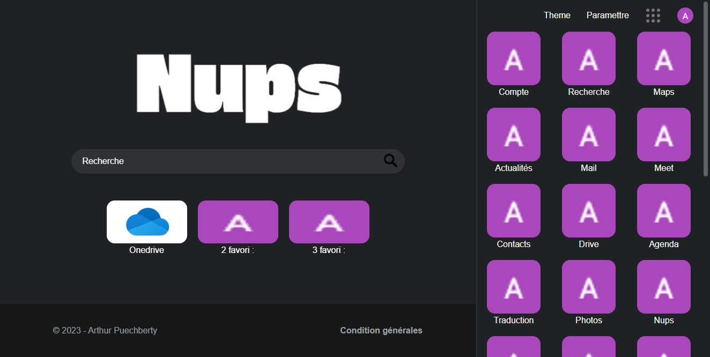

# Portfolio d'Arthur Puechberty

Bienvenue sur mon portfolio personnel, conçu avec Adonis JS. Vous trouverez ici une présentation de moi-même, de mes projets, ainsi que les moyens de me contacter. Mon objectif est de partager mon parcours, mes compétences et mes réalisations en développement web.

## Table des matières

- [Aperçu](#aperçu)
- [À propos](#à-propos)
- [Projets](#projets)
- [Contact](#contact)
- [Licence](#licence)

## Aperçu

Ce portfolio a été créé pour mettre en avant mon parcours en tant que développeur web autodidacte. Il est conçu pour être à la fois informatif et esthétiquement attrayant. Voici un aperçu de la page d'accueil :

## À propos

### Présentation

Je m'appelle Arthur Puechberty et je suis passionné par le développement web. Chaque ligne de code que j'écris est une étape vers la création d'expériences uniques et engageantes. Je suis animé par le désir de donner vie à des idées et de les façonner en designs innovants.

### Mon parcours

J'ai acquis de l'expérience en développement web en travaillant sur divers projets, allant du front-end au back-end. J'ai une maîtrise des langages tels que HTML, CSS, JavaScript, et j'ai travaillé avec des frameworks modernes comme Adonis avec Node.js.

### Ma philosophie

Je crois fermement que chaque difficulté est une opportunité de créer quelque chose de nouveau et d'excitant. Mon approche consiste à combiner fonctionnalité et esthétique pour offrir des expériences exceptionnelles aux utilisateurs.

### Mes compétences

- Développement web
- Web design
- Développement d'applications
- Gestion de projets

### Mes centres d'intérêt

En dehors du développement, j'aime explorer de nouveaux endroits, la photographie, la lecture de livres sur la technologie et la créativité, et la voile !

### Ma vision

Mon objectif est de continuer à apprendre, à innover et à inspirer à travers mes projets. Je veux contribuer à créer un web meilleur et plus engageant pour tous.

## Projets

### Projet NUPS

NUPS est l'un de mes projets les plus récents. 

## Contact

N'hésitez pas à me contacter si vous avez des questions ou si vous souhaitez collaborer sur un projet passionnant. Vous pouvez me joindre par e-mail à [email@exemple.com] ou me suivre sur les réseaux sociaux en utilisant les liens ci-dessous.

- [Instagram](https://www.instagram.com/arthur.pbty/)
- [GitHub](https://github.com/Tutur33)
- [Discord](https://discord.gg/HxgaA44CPh)
- [Site Web](http://tuturp33.000webhostapp.com)

## Licence

Ce projet est sous licence [MIT](LICENSE).
