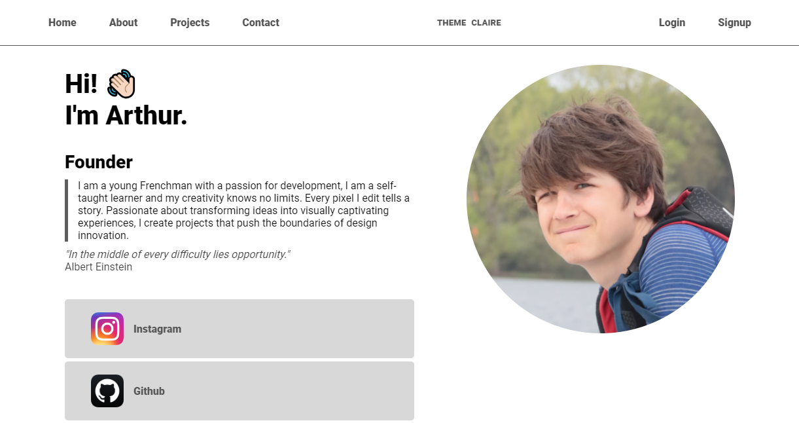

# Arthur Puechberty's Portfolio

Welcome to my personal portfolio, designed with Adonis JS. Here you'll find a presentation of myself, my projects and how to contact me. My aim is to share my background, skills and achievements in web development.

## Table of contents

- [Overview](#overview)
- [About us](#about-us)
- [Projects](#projects)
- [Contact](#contact)
- [License](#license)

## Overview

This portfolio has been created to showcase my career as a self-taught web developer. It is designed to be both informative and aesthetically appealing. Here's a preview of the home page:

## About us

### Presentation

My name is Arthur Puechberty and I'm passionate about web development. Every line of code I write is a step towards creating unique and engaging experiences. I'm driven by the desire to bring ideas to life and shape them into innovative designs.

### My background

I've gained experience in web development by working on various projects, from front-end to back-end. I'm proficient in languages such as HTML, CSS, JavaScript, and have worked with modern frameworks like Adonis with Node.js.

### My philosophy

I firmly believe that every challenge is an opportunity to create something new and exciting. My approach is to combine functionality and aesthetics to deliver exceptional user experiences.

### My skills

- Web development
- Web design
- Application development
- Project management

### My interests

Outside of development, I enjoy exploring new places, photography, reading books on technology and creativity, and sailing!

### My vision

My goal is to continue learning, innovating and inspiring through my projects. I want to help create a better, more engaging web for everyone.

## Projects

### NUPS project

NUPS is one of my most recent projects.

## Contact

Please don't hesitate to contact me if you have any questions or would like to collaborate on an exciting project. You can reach me by e-mail at [email@exemple.com] or follow me on social networks using the links below.

- [Instagram](https://www.instagram.com/arthur.pbty/)
- [GitHub](https://github.com/Tutur33)
- [Discord](https://discord.gg/HxgaA44CPh)
- [Other networks](http://tuturp33.000webhostapp.com)

## License

This project is under [proprietary license](LICENSE).
